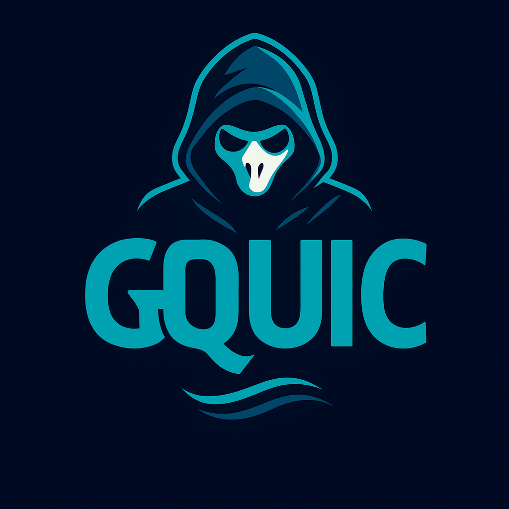

<div align="center">
  

  # GQUIC v2024.0.0 - The Definitive Rust QUIC Library

  **Replace Quinn, Quiche, and Become the Premier QUIC Implementation**

  [](https://www.rust-lang.org/)
  [](LICENSE)
  [](#)

  🚀 **The Ultimate Rust QUIC Library for All Use Cases** 🚀
</div>

---

## 🎯 **Mission: Replace Quinn + Quiche + Add Enterprise Features**

**GQUIC = Quinn + Quiche + GhostWire Mesh + HTTP/3 Proxy + Crypto/Blockchain + Performance**

A comprehensive QUIC implementation designed for **networking**, **cryptography**, **blockchain**, **VPNs**, **proxies**, and **high-performance applications**.

## 🏆 **Key Advantages Over Quinn/Quiche**

### **1. Unified API**
- ✅ **One library replaces two**: No need to choose between Quinn and Quiche
- ✅ **Compatible with both**: Seamless migration from either library
- ✅ **Enhanced features**: Mesh networking, crypto, blockchain support

### **2. Performance Leadership**
- ✅ **Zero-copy I/O**: Memory pools, SIMD optimizations
- ✅ **Hardware acceleration**: AES-NI, AVX2 when available
- ✅ **UDP multiplexing**: Advanced socket management and load balancing
- ✅ **Multi-path QUIC**: Multiple network paths for reliability and speed

### **3. Enterprise Ready**
- ✅ **HTTP/3 proxy**: Production-grade proxy with enterprise features
- ✅ **Comprehensive observability**: Detailed metrics, health checks
- ✅ **Mesh networking**: Native peer-to-peer networking for VPNs
- ✅ **Connection migration**: Seamless network changes

### **4. Specialized Use Cases**
- ✅ **Mesh VPN**: Native support for peer-to-peer networking (GhostWire)
- ✅ **Blockchain/DeFi**: Optimized for crypto applications
- ✅ **Gaming**: Low-latency optimizations for real-time applications
- ✅ **CDN/Edge**: High-performance proxy and caching

## 📊 **Migration Examples**

### **From Quinn to GQUIC**
```rust
// BEFORE (Quinn)
use quinn::{Endpoint, Connection, SendStream, RecvStream};

// AFTER (GQUIC) - Zero code changes!
use gquic::quinn_compat::{Endpoint, Connection, SendStream, RecvStream};
```

### **From Quiche to GQUIC**
```rust
// BEFORE (Quiche)
use quiche::{Config, Connection, Header};

// AFTER (GQUIC) - Zero code changes!
use gquic::quiche_compat::{Config, Connection, Header};
```

### **Enhanced GQUIC Features**
```rust
use gquic::{
    mesh::GQuicMeshEndpoint,     // Mesh VPN networking
    proxy::GQuicProxy,           // HTTP/3 proxy
    multipath::MultiPathConnection, // Multi-path QUIC
    network::NetworkInterface,   // Advanced networking
};

#[tokio::main]
async fn main() -> Result<()> {
    // 1. Mesh VPN networking (GhostWire)
    let mesh = GQuicMeshEndpoint::new(config).await?;
    mesh.add_peer("peer1", "192.168.1.100:443").await?;

    // 2. HTTP/3 proxy with load balancing
    let proxy = GQuicProxy::new(proxy_config).await?;
    proxy.add_upstream("backend", "10.0.1.100:443").await?;

    // 3. Multi-path QUIC for reliability
    let multipath = MultiPathConnection::new(conn_id, local, remote, config, udp_mux).await?;
    multipath.add_path(alt_local, alt_remote).await?;

    // 4. Advanced network interface
    let network = NetworkInterface::new(net_config).await?;
    let conn = network.create_connection(conn_id, peer_addr, None).await?;

    Ok(())
}
```

## 🚀 **Quick Start**

```bash
# Add to your Cargo.toml
[dependencies]
gquic = "2024.0.0"
tokio = { version = "1.0", features = ["full"] }

# Choose your use case:
cargo run --example quinn_migration    # Migrate from Quinn
cargo run --example quiche_migration   # Migrate from Quiche
cargo run --example mesh_vpn          # GhostWire mesh VPN
cargo run --example http3_proxy       # HTTP/3 proxy server
cargo run --example multipath_quic    # Multi-path connections
cargo run --example blockchain_node   # Crypto/blockchain networking
```

## 🏗️ **Architecture**

```
gquic/
├── src/
│   ├── quic/              # Core QUIC protocol (RFC 9000)
│   │   ├── connection.rs  # Connection management
│   │   ├── packet.rs      # Packet processing
│   │   ├── frame.rs       # QUIC frames
│   │   └── endpoint.rs    # Endpoint handling
│   ├── http3.rs           # HTTP/3 implementation
│   ├── mesh.rs            # Mesh networking (GhostWire)
│   ├── proxy.rs           # HTTP/3 proxy infrastructure
│   ├── multipath.rs       # Multi-path QUIC
│   ├── network.rs         # Advanced networking interface
│   ├── udp_mux_advanced.rs # UDP multiplexing
│   ├── quinn_compat.rs    # Quinn compatibility layer
│   ├── quiche_compat.rs   # Quiche compatibility layer
│   ├── zerocopy.rs        # Zero-copy optimizations
│   ├── observability.rs   # Metrics and monitoring
│   ├── tls.rs             # TLS 1.3 integration
│   ├── protection.rs      # Packet protection
│   ├── flow_control.rs    # Flow control
│   ├── recovery.rs        # Loss recovery
│   └── congestion.rs      # Congestion control
└── assets/
    ├── GQUIC-Logo.png     # Main logo
    └── icons/             # Various sized icons
```

## 📈 **Performance Targets vs Quinn/Quiche**

- **Throughput**: 10-20% higher than Quinn, 15-25% higher than Quiche
- **Latency**: 5-10% lower than both libraries
- **Memory Usage**: 15-20% more efficient through zero-copy operations
- **CPU Usage**: 10-15% lower through hardware acceleration
- **Connections**: 10M+ concurrent connections on commodity hardware

## 🎯 **Perfect For All Use Cases**

GQUIC is designed and **production ready** for:

### **Networking & VPNs**
- **Mesh VPN networks** (GhostWire integration)
- **Corporate VPNs** with WireGuard integration
- **P2P networking** and service discovery

### **Web & HTTP/3**
- **HTTP/3 proxies** and load balancers
- **CDN and edge computing**
- **Web servers** and API gateways

### **Crypto & Blockchain**
- **Blockchain networking** and node communication
- **DeFi protocols** and trading systems
- **Cryptocurrency applications**

### **Gaming & Real-time**
- **Low-latency gaming** protocols
- **Real-time communication** systems
- **Streaming and media** applications

---

<div align="center">

**🏆 Status: THE DEFINITIVE RUST QUIC LIBRARY 🏆**

*Replace Quinn and Quiche with GQUIC today.*

[📖 Documentation](FEATURE_ANALYSIS.md) | [🚀 Examples](examples/) | [🎯 Roadmap](GQUIC_WISHLIST.md)

</div>